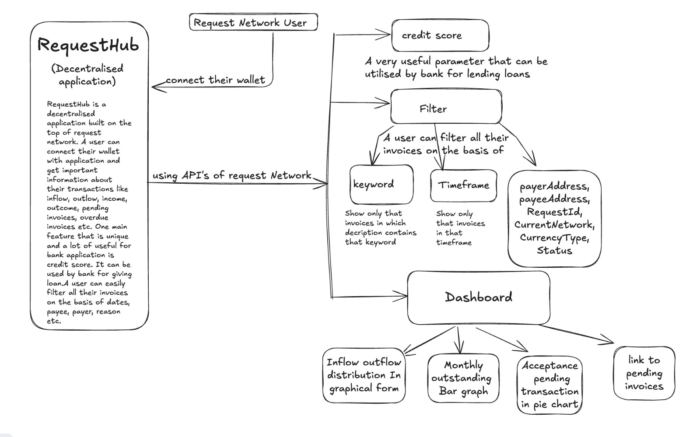

# RequestHub

RequestHub is a decentralized application built on top of the Request Network. Users can connect their wallets to the application and get important information about their transactions, such as personalized transactions, inflow, outflow, income, outcome, pending invoices, overdue invoices, etc. One unique and highly useful feature for banking applications is the credit score, which can be used by banks for loan approvals. Users can easily filter all their invoices based on dates, payee, payer, reason, etc.

## Getting Started

First, run the development server:

bash
npm run dev

# or

yarn dev

# or

pnpm dev

# or

bun dev

Open [http://localhost:3000](http://localhost:3000) with your browser to see the result.

You can start editing the page by modifying `app/page.tsx`. The page auto-updates as you edit the file.

This project uses [`next/font`](https://nextjs.org/docs/app/building-your-application/optimizing/fonts) to automatically optimize and load [Geist](https://vercel.com/font), a new font family for Vercel.

## Usage

- You can keep track and know useful insights of transactions by using the frontend GUI (**Graphical User Interface**) or the one deployed [Link](https://request-hub-njs6.vercel.app/).
- A user can easily get loan by showing thier credit score. Also user can easily know about their personalised transaction, inflow, outlow, income, outcome, pending invoices, overdue invoices etc. and can use this to track thier invoices.
- A user can easily filter their transactions by using our advanced filtering feature. Transactions can be filtered on the basis of payee, payer, keywords etc.

## Implementation Details

## Demo Video Link

Click [here](https://www.loom.com/share/56f1526ed970480895b8e4b18735bded?sid=3fda3305-839e-404c-a0a8-47eb6358440e) to see a working demo!

## Learn More

To learn more about Request Network, take a look at the following resources:

- [RequestNetwork Documentation](https://docs.request.network/) - learn about Request Network features.
- [Next.js Documentation](https://nextjs.org/docs) - learn about Next.js features and API.
